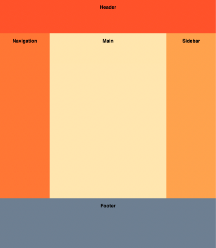

# Contact Form

## Description

The Holy Grail layout is a famous CSS page layout that has traditionally been hard to implement. It consists of a header, footer, and three columns. The left column contains navigation items, the middle column contains the page contents, and the right column contains ads.



Implement the Holy Grail layout using just CSS. You shouldn't need to change the HTML too much.

### Requirements

- Header
  - Stretches horizontally across the whole page.
  - 60px tall.
- Columns
  - Both the left and right columns have a fixed width of 100px.
  - The center column is fluid-width.
  - All the columns should have the same height, regardless of which column is the tallest.
- Footer
  - Stretches horizontally across the whole page.
  - 100px tall.
  - The footer should be at the bottom of the page even if there is not enough content to fill up the viewport height.

### What I Learned

- Set height of the wrapper, in this case, the HTML "body" tag, to 100vh to make sure Footer sticks to the bottom of the page regardless of content height.
- How to use CSS Grid:
  - 1. Set "display" to "grid".
       Example:
    ```CSS
        .grid-container {
            display: grid;
        }
    ```
  - 2. On the wrapper, use "grid-template-columns" to set the number of total columns (tracks) and their widths. In this case, I mixed px units for fixed width and fr units for fluid width. Use "grid-template-rows" to set the number of total rows (tracks) and their widths.
       Example:
    ```CSS
        .grid-container {
            grid-template-columns: 100px 1fr 100px;
            grid-template-rows: 60px 1fr 100px;
        }
    ```
  - 3. On each individual component that makes up part of the grid, use "grid-column" and "grid-row" to set how many columns/rows that component should cover.
       Example:
    ```CSS
        .grid-child-1 {
            grid-column: 1 / 4;
            grid-row: 1 / 2;
        }
    ```
- The most widely-supported solution is to use Flexbox, since it has great browser support and easiest to understand. Grid isn't as well-supported as Flexbox for now.
  - Use flex-grow and flex-shrink for fluid widths.
  - Helpful resource to understand flex-grow, flex-shrink, and flex-basis: [CSS-Tricks: Understanding flex-grow, flex-shrink, and flex-basis](https://css-tricks.com/understanding-flex-grow-flex-shrink-and-flex-basis/)
